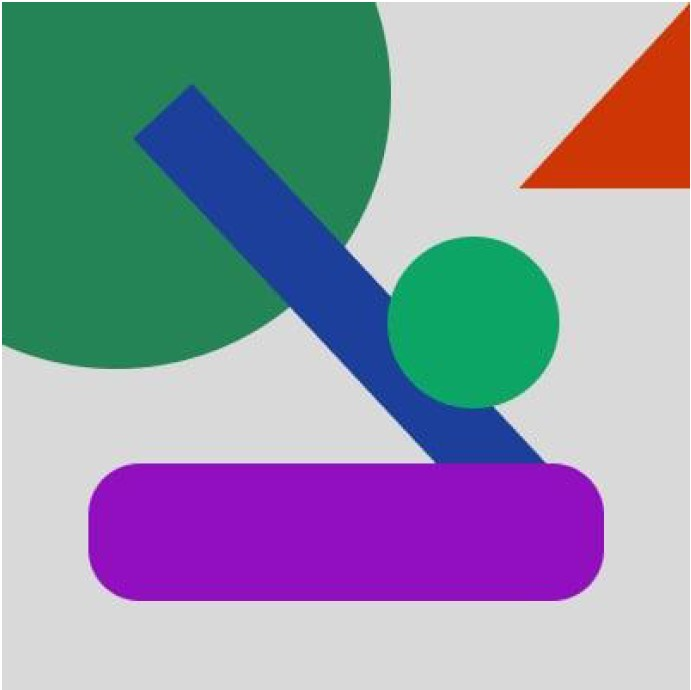

///
Test for positioning abstract figures in HTML with help of perfect-pixel and by using image (image is bellow).
It has been used absolute and relative positioning.

////
Тестовое задание по позиционированию абстрактных фигур в HTML при помощи perfect pixel и использования референтного изображения (изображение ниже).
Использовалось абсолютное и относительное позиционирование.

